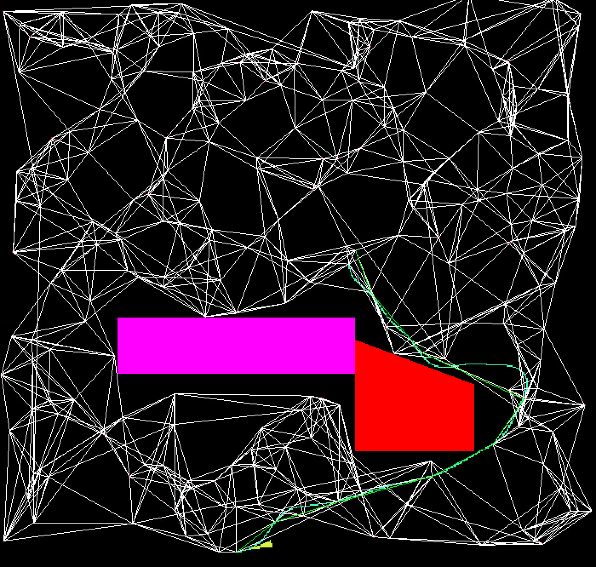

# Robot Simulator

## About this Project

This project is a 2D robot simulator made in my spare time, implemented from scratch in C++ and using SFML for the graphics (and Eigen for math). The goal is to try to simulate a robot without using any external libraries (aside from the visualization and Eigen).

Here's an example of the path generated by the project:



## Dependencies:
- C++17
- SFML 2.6+
- Eigen 3.3+
- CMake 3.14+

## Build Instructions:

Building the project requires creating a build folder and then making the project.
```
mkdir build
cd build
cmake ..
make -j4
```

## Running the Project:

Simply run the executable. For now there are no command line arguments, but there will be in the future. 

### Changing the Parameters:

For now, parameters much be changed in the source code, but there will be a config file and command line arguments in future versions.


## What's been implemented so far

As of now, map generation and trajectory generation have been implemented. We use K-Nearest Neighbours to construct the graph of all possible waypoints. Currently, we use Trajectory Rollout as our trajectory generator. Collision checking has also been implemented.

An Ackerman-drive based robot model has been implemented. 

## What's in the works:

- [ ] Clean-up the current code and split different aspects (trajectory generation, collision checking, etc) into modules. 
- [ ] Parralelize the trajectory generation to speed it up
- [ ] Implement a sensor model, along with randomly generated noise
    - [ ] Lidar Model
    - [ ] Wheel Odometry
- [ ] Implement a state estimator (either Factor Graph based or a simple Kalman Filter)
- [ ] Implement additional robot models
    - [ ] Holonomic Robot
    - [ ] Legged Robot (much later on)
- [ ] Implement a mapping algorithm
    - [ ] Simple occupancy grid to start
- [ ] Implement a SLAM algorithm

## Author
Ryan Zazo
